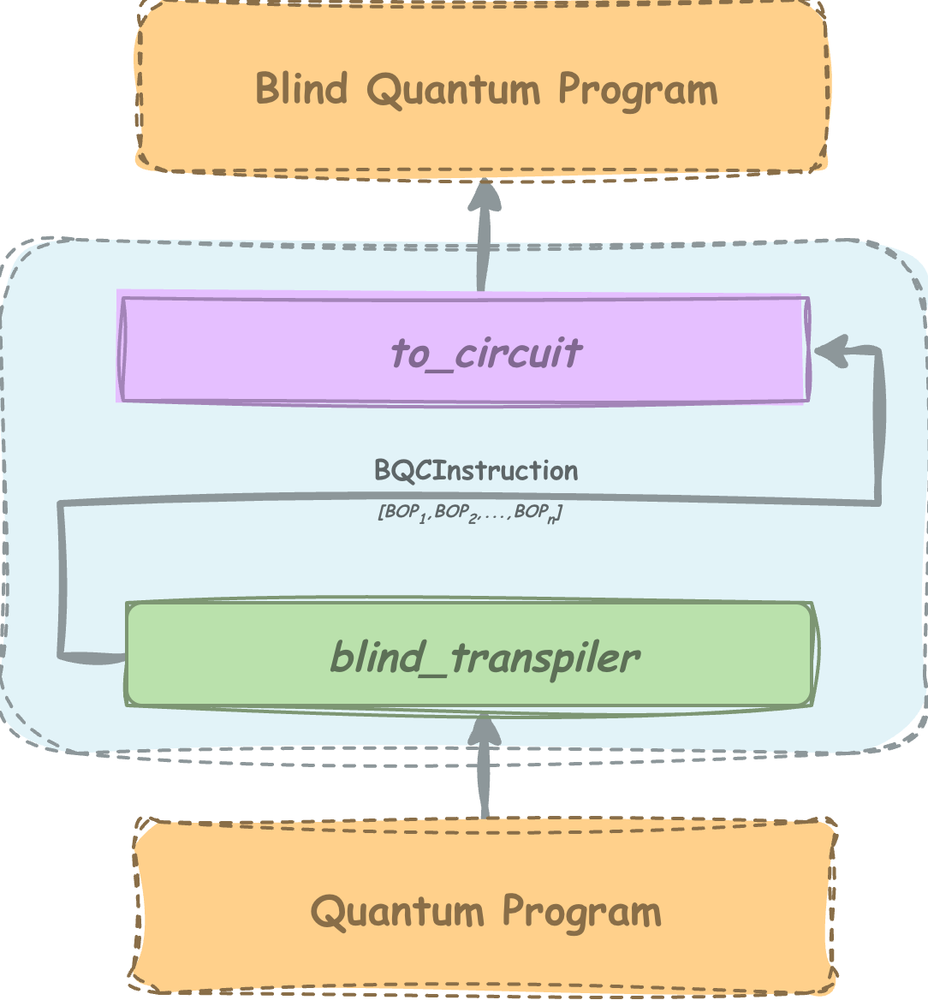
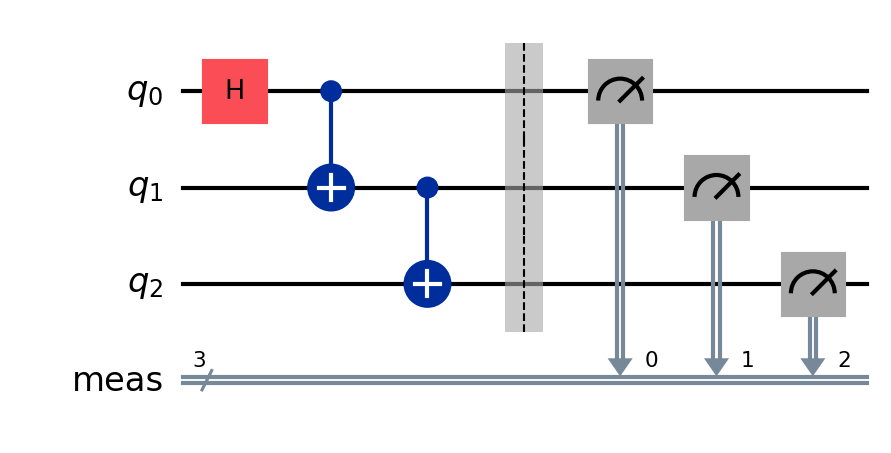
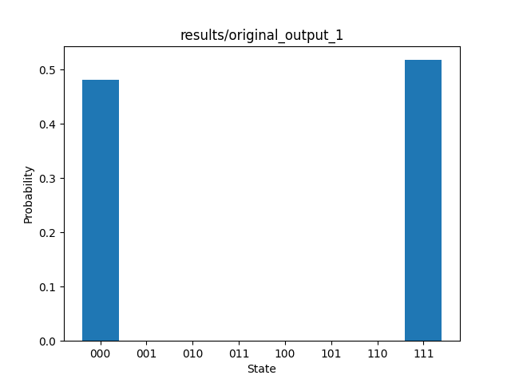
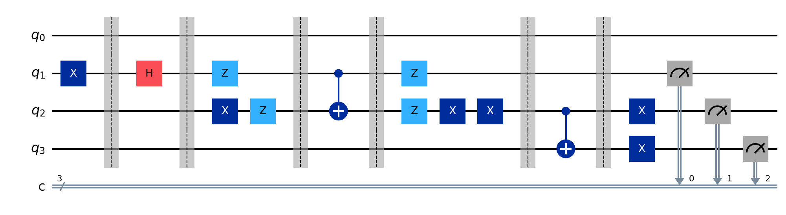
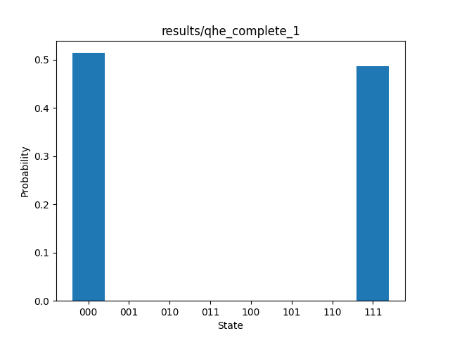
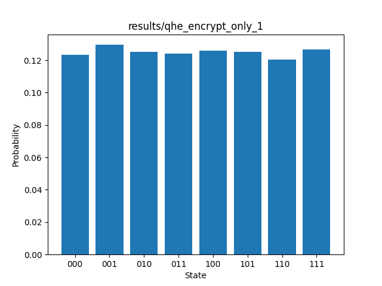
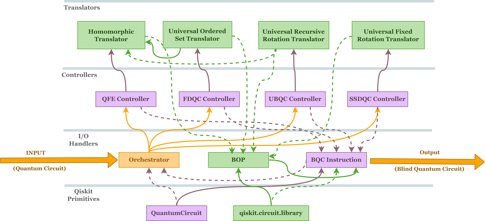

# Blind Transpiler: An open-source library for quantum homomorphic encryption and universal blind quantum computation 

[](https://opensource.org/licenses/Apache-2.0) 
[](https://doi.org/10.5281/zenodo.21437378)


Blind quantum computation (BQC) allows a limited-capability client to perform complex quantum computation on a remote server without revealing input, output, or computation. This primitive solves a problem of cryptography called '*Secure Delegated Computation*'.

This cryptographic primitive enables application in various area like quantum homorphic encryption, secure quantum approximation algorithm, quantum private query, quantum multi-party computation, secret sharing protocols, blind factorization, quantum searachable encryption, among many other. 

This python library presents first software tools to convert any quantum circuit written in Qiskit to its blind counterpart, allowing rapid prototyping of application of BQC cryptography.


## Highlights
The library generates the circuit, which can be simulated in *client-server* architecture, where client is assumed to have the capability to perform $X$, $Z$, $Swap$ and $Measure$
The library can implement four types of blind transpilation:
1. `qhe`: quantum homomorphic encryption translation of the given circuit, which hides client's data on server. This approach is capable of handling parametric gates like $R_z(\theta)$.
2. `ubqc`: universal blind translation of the given circuit, which hides client's data and computing algorithm on the server using a resource state based on recursive rotation gates. This approach is capable of handling parametric gates like $R_z(\theta)$.
3. `fdqc`: universal blind translation based on resource state based on ordered set of universal gates. This approach converts parametric gates to nonparametric resource for blind transpilation, as it cannot handle the parametric gates natively.
4. `ssdqc`: universal blind translation based on fixed rotation gate universal resource set. This approach converts parametric gates to nonparametric resource for blind transpilation, as it cannot handle the parametric gates natively. 

## Get Started
blind_transpiler is an open source qiskit-based library for rapid prototyping of quantum homomorphic encryption and universal blind quantum computation in circuit-based model.




### Install using pypi
The blind_transpiler library can be installed using pypi as:
```
pip install blind-transpiler
```

To install directly from source, (collect zip file of program from supplemantary material)
```bash
# Install the package (from the root of the folder)
pip install .
```

## Creating your first program

Let's take a simple circuit of GHZ state:

```python
from qiskit import QuantumCircuit
qc = QuantumCircuit(3)
qc.h(0)
qc.cx(0,1)
qc.cx(1,2)
qc.measure_all()
```
The circuit will be given as:


Let us also define a simulator for the circuit
```python
def run_circuit(circ):
    backend = AerSimulator()
    shots = 1000
    t_circ = transpile(circ, backend)
    results = backend.run(t_circ, shots=shots).result()
    return results
```
If we run the circuit of GHZ state defined above on the qiskit simulator, we will see the output as:



This circuit can be converted to its equivalent blind circuit using `blind_transpiler` library as:

```python
from blind_transpiler import BQC
bqc = BQC()
bqc_instructions = bqc.generate_bqc(circ=qc, format='qhe')
```

This `bqc_instruction` objects contains the sequence of gate and the instruction to delegate then in the client-server architecture. We can try four different format, namely, *qhe*, *ubqc*, *fdqc*, *ssdqc*. 

For more control on the encryption process, we can explicitly estimated the size of encryption key and generate it using any random process, or library defined process as:
```python
from blind_transpiler import BQC
bqc = BQC()
key_size = bqc.estimate_keysize(format='qhe', circ=qc)
keys =  bqc.generate_random_key(key_size=key_size, key_style='rand')
bqc_instructions  = bqc.generate_bqc(circ=circ, format ='qhe', keys=keys)
```
The object `bqc_instructions` can be probed to get the various parameters associated with delegation as:
```python
print(bqc_instrucion.n_client_gates)
print(bqc_instrucion.n_server_gates)
print(bqc_instrucion.n_secure_gates)
print(bqc_instrucion.n_communication_rounds)
```
The object `bqc_instructions` is virtually a collection of modified gate object which can be further probes for additional information as:
```python
for elem in bqc_instructions:
    print(elem.op_type)
    print(elem.conditional)
    print(elem.gate)
```
Here, `op_type` defines the type of operation that the given instruction perform. For instance, it can be a client operated gate, or server delegated gate, or it might be gate necessary for encryption or decryption. `conditional` give the value of boolean variable which can be $0$, meaning the gate in not needed in final conversion or $1$, gate is needed in final execution based on the encryption key given. `gate` is the object of Qiskit instruction class which will actually be appended if the circuit is delegated to the server.

The object `bqc_instructions` can further be use to simulate the result be generating Qiskit circuit for this objection
```python
blind_circ = bqc_instructions.to_circuit(const_type='complete', show_barrier=True) 
```
This will result in a quantum circuit written in Qiskit, which in our case will look like:

This circuit when simulate over client-server architecture will result in the output as desired by original circuit:


However, if we delegate the circuit without proper decryption, we will get output unrelated to the original output. The output can be generated over $1000$ random key values as: 
```python
blind_format = 'qhe'
const_type = 'encrypt_only'
n_samples = 1000

bqc_trial = BQC()
estimated_key_size = bqc_trial.estimate_keysize(format=blind_format, circ=qc)
random_sample_key_space =  generate_binary_samples(n_samples,estimated_key_size)
n_clbits = circ.num_clbits
output = {output_key: 0 for output_key in [format(i, f'0{n_clbits}b') for i in range(2**n_clbits)]}

for keys in tqdm(random_sample_key_space):
    blind_circ, _ = blind_transpiler(circ=circ,blind_format=blind_format, const_type=const_type, keys=keys)
    results = run_circuit(blind_circ).get_counts()
    for k in results.keys():
        output[k] = results[k]

return output

```
The output over $1000$ random keys will be:



## Developer Notes:
The library is designed to be modular, reusable and robust against changes in Qiskit primitive. This is done by dividing the architecture of library in four different layers:
1. **Layer 0 (Qiskit Primitives)**: This the qiskit interface which uses QuantumCircuit and qiskit.circuit.library primitives to function properly.
2. **Layer 1 (I/O Primitives)**: This layer primarly interface with the qiskit layer and orchestrate the process of blind transpilation. (*The library can also be extended to other quantum programming primitives with minimal refactoring in this layer*)
3. **Layer 2 (Controllers)**: This layer defines the algorithms that controll the transpilation with rules written in transpilation library. (*Developers can easily add new protocols of blind quantum computation in this layer, enhancing the functionallity*).
4. **Layer 3 (Transaltors)**: This layer contains the rules of transpilation that are used by controller to transpile the circuit to its blind counterpart. (*New rules of transpilation can be written here, or existing rules can be used to create new controllers*).

A complete documentation of the library describing each feature is given in index.html file of *documentation* folder.

The UML-like relationship between the modules can be visualize as:


The folder structure of the code is:

```text
blind_transpiler/
|
├──README.md
├──tests            # contain testcases for library
├──documentation     # contain html documentation of the library
├──.gitignore
├──CONTRIBUTIONS.md
├──LICENSE
├──NOTICE
├──pyproject.toml     # contain configuration files for library installation
├──requirements.txt
├──blind_transpiler/
    │
    ├── __init__.py          
    ├── global_value_store.py       # controller of the tests
    ├── essentials       # contains the class in which the output is given
    │   └── bop.py
    │   └── bqc_instruction.py
    ├── controllers       # has the orchestrator of library and controller for various protocols
    │   └── base.py
    │   └── orchestrator.py
    │   └── qhe.py
    │   └── ubqc.py
    │   └── fdqc.py
    │   └── ssdqc.py
    ├── translators       # defines the translation rules for various protocols
    │   └── base.py
    │   └── homomorphicTranslator.py
    │   └── universalRecursiveRotationTranslator.py
    │   └── universalOrderedSetTranslator.py
    │   └── universalFixedRotationTranslator.py

```


## Licence
`blind_transpiler` is licensed under the [Apache 2.0](https://www.apache.org/licenses/LICENSE-2.0) license.

## Acknowledgments
This project builds using features of the Qiskit open-source quantum computing framework.
